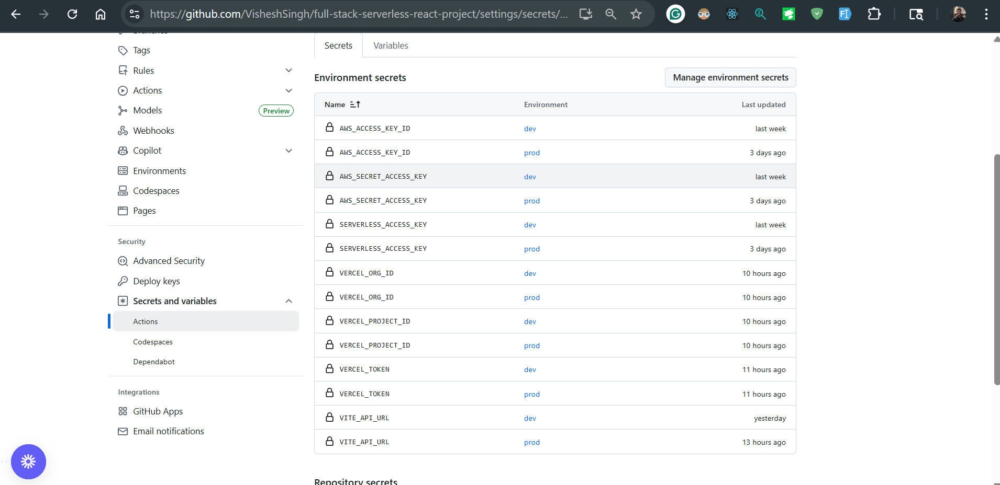
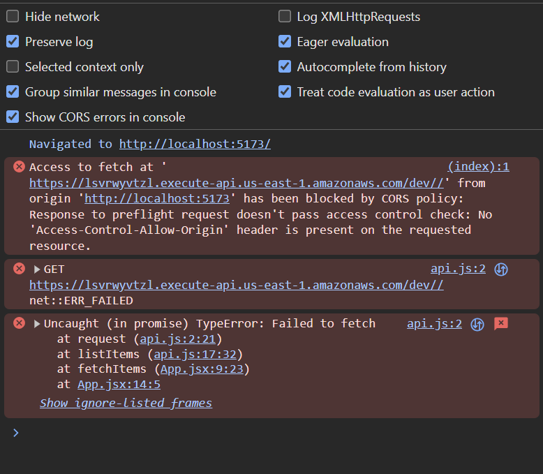
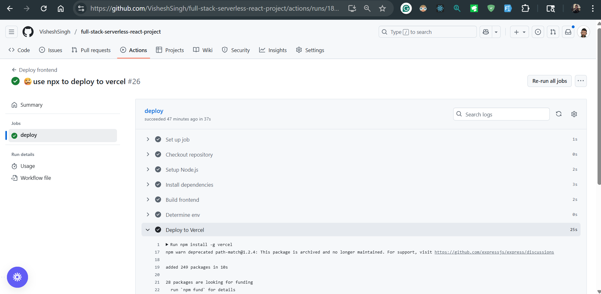
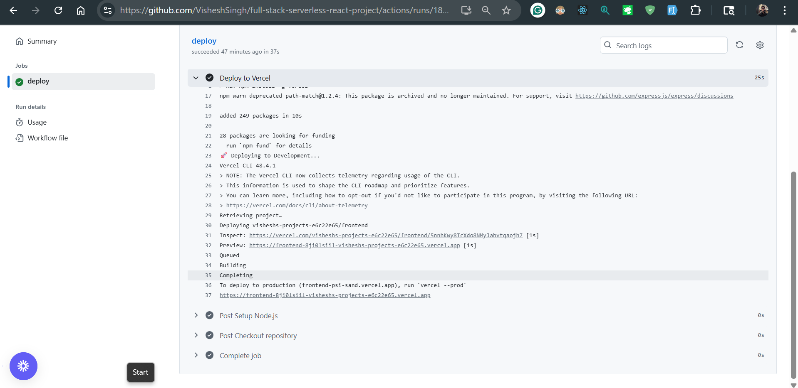

# Full Stack Serverless Web App

This project is a **full-stack web application** consisting of:

- A **Vite + React** frontend hosted on **Vercel**
- A **Node.js (or AWS Lambda)** backend behind an **API Gateway**
- Automated deployments via **GitHub Actions** (worflows are ready to pick up code changes deployed to develop and master branch)

The setup is designed for clean CI/CD, environment consistency, and secure secret handling.

---

## Project Structure

root/
├── backend/
│ ├── src/
│ ├── package.json
│ ├── serverless.yml
│ └── handlers
│ └── resources (dynamodb config)
│ └── iam (for permissions)
│
├── frontend/
│ ├── src/
│ ├── vite.config.js
│ ├── package.json
│ ├── .env (required for Vercel deployment)
│ └── dist/ (build output)
│
└── .github/
└── workflows/
└── backend-dev.yml
└── frontend-dev.yml

## ⚙️ Environment Variables

| Variable                | Used In         | Description                                           | Source                              |
| ----------------------- | --------------- | ----------------------------------------------------- | ----------------------------------- |
| `VITE_API_URL`          | Frontend        | Backend API base URL (e.g., AWS API Gateway endpoint) | GitHub Secret or Vercel Environment |
| `AWS_ACCESS_KEY_ID`     | Backend         | AWS Deployment Credential                             | GitHub Secret                       |
| `AWS_SECRET_ACCESS_KEY` | Backend         | AWS Deployment Credential                             | GitHub Secret                       |
| `VERCEL_TOKEN`          | Frontend Deploy | Authenticates deploys to Vercel                       | GitHub Secret                       |

### Important

Vite only exposes environment variables **prefixed with `VITE_`** to frontend code.

For example:

```js
const BASE_URL = import.meta.env.VITE_API_URL;
```

#### Vercel env var settings -

NOTE: Github Secret this did not work for me 🤷 as prod deploy faced issues injecting the env var - `VITE_API_URL` so, i used vercel environment variable for Prod to make it work


#### Github secrets -



#### List of deployments -

Link: https://github.com/VisheshSingh/full-stack-serverless-react-project/deployments


### Deployment Workflow

Development Environment (Branch: develop)

- Deploys automatically to Vercel Preview.

- Uses VITE_API_URL pointing to the dev backend.

- Environment variables are set either via:

  - GitHub Secrets

  - Vercel Project → Settings → Environment Variables → Development Target

Production Environment (Branch: master)

- GitHub Actions runs build and deployment steps:

- Installs dependencies for both frontend and backend.

- Deploys backend (e.g., AWS Lambda + API Gateway).

- Builds frontend with VITE_API_URL injected from GitHub Secrets or Vercel deployment

- Deploys frontend to Vercel Production.

### API Gateway setup (dev)

##### (without options)


### CORS error

.png>)



### API Gateway setup (dev)

##### (with cor options setup)


##### (local testing works ✅)


### Deployment jobs (on push)






### Frontend application deployed to prod on vercel -

https://frontend-q0e9cz7rw-visheshs-projects-e6c22e65.vercel.app/

### Backend API deployed to prod stage -

https://mjxskz83zl.execute-api.us-east-1.amazonaws.com/prod

### Backend API deployed to dev stage -

https://lsvrwyvtzl.execute-api.us-east-1.amazonaws.com/dev
